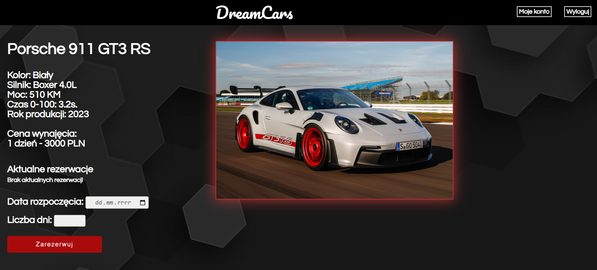

# DreamCars-car-rental
### DreamCars - car rental web application

This web application is dedicated to car rental companies.
I created this application in order to practice web development and data base menagement.

It includes:
* login and registration system (with data validation)
* administration panel (to check statistics and rental ranking)
* your own profile statistics (rentals and dates covering them)
* cancellation option (if the car rental has not started yet)
* the ability to rent a car from a list, specifying the start date and number of rental days (with data validation)
* an algorithm that prevents more than one person from renting the same car at a same time
* option to change personal data
* logout option

 

Used languages:
* HTML
* CSS
* PHP
* JavaScript
* SQL

Application saves and reads data from database using SQL querries.
This web application is in Polish language.

 

Screenshots (some photos are on a reduced version of the page to capture more of it):

* Main page (there are 9 cars in total):

    

* Login:

    

* Register:
    

* Reservation page:

    

* Profile:
  
    

* Data settings:
  
    

* Stats (only for administrator):

    